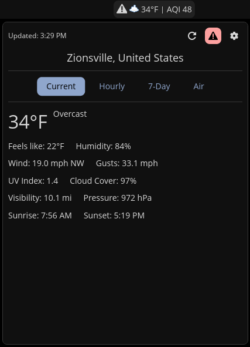
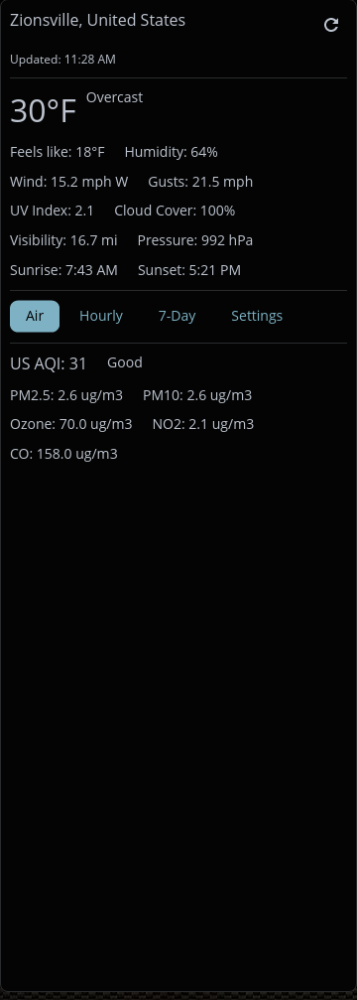
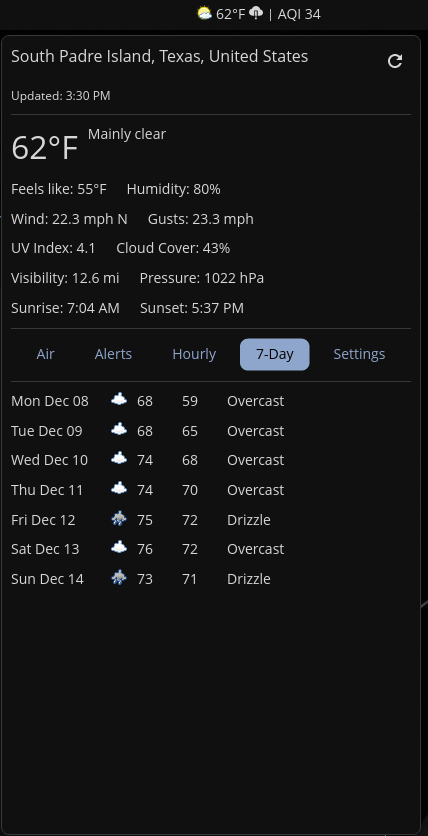
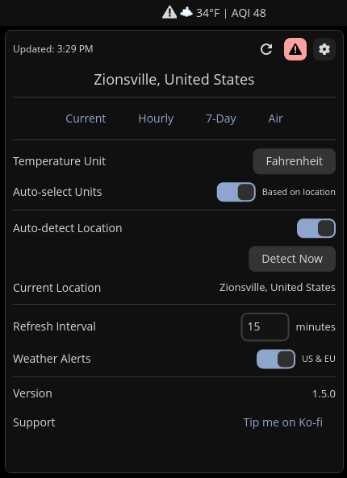

# Tempest

A weather applet for COSMIC Desktop with automatic location detection.

## Screenshots

| Main | Air Quality | 7-Day Forecast | Settings |
|------|-------------|----------------|----------|
|  |  |  |  |

*Note: Hourly and Alerts tabs not shown above.*

## Roadmap
   
   See planned features and progress on the [Project Board](https://github.com/users/VintageTechie/projects/1)

## Features

- Real-time weather data from Open-Meteo API (no API key required)
- Current temperature and AQI displayed in panel
- Detailed popup with tabbed interface:
  - Current conditions (temperature, feels-like, humidity)
  - Wind information (speed, direction, gusts)
  - UV index, cloud cover, visibility, pressure
  - Sunrise and sunset times
  - **Air Quality tab**: AQI (US/EU standards), PM2.5, PM10, Ozone, NO2, CO levels
  - **Alerts tab**: Weather alerts from NWS (US), ECCC (Canada), MeteoAlarm (EU)
  - **Hourly tab**: Next 12 hours forecast with precipitation probability
  - **7-Day tab**: Weekly forecast with high/low temperatures
  - **Settings tab**: All configuration options
- Automatic location detection via IP geolocation
- Manual location override with city search
- Remembers last selected tab between sessions
- Configurable temperature unit (Fahrenheit/Celsius)
- Configurable measurement system (Imperial/Metric) for wind and visibility
- Configurable refresh interval
- Desktop notifications for weather alerts
- Persistent configuration
- Global weather coverage

## Installation

Clone the repository:

```bash
git clone https://github.com/VintageTechie/cosmic-ext-applet-tempest
cd cosmic-ext-applet-tempest
```

Build and install the project:

```bash
just build-release
sudo just install
```

For alternative packaging methods:

- `deb`: run `just build-deb` and `sudo just install-deb`
- `rpm`: run `just build-rpm` and `sudo just install-rpm`

For vendoring, use `just vendor` and `just vendor-build`

## Configuration

Click the applet to open the popup and navigate to the Settings tab where you can:

- Toggle between automatic and manual location detection
- Search for a city by name or enter coordinates manually
- Toggle temperature unit (Fahrenheit/Celsius)
- Toggle measurement system (Imperial/Metric)
- Set refresh interval (1-1440 minutes)
- Enable or disable weather alerts
- Toggle AQI display in panel

Settings are automatically saved and persist across sessions. The applet defaults to New York City coordinates (40.7128, -74.0060) if no location is detected.

## Translations

Tempest supports internationalization via Fluent. Translation files are in `i18n/`:

```
i18n/
  en/cosmic_ext_applet_tempest.ftl   # English (default)
```

To add a new language, copy the English file to a new directory (e.g., `i18n/de/` for German) and translate the strings. The applet automatically detects the system language.

## Development

A [justfile](./justfile) is included with common recipes:

- `just build-debug` - Compile with debug profile
- `just check` - Run clippy linter
- `just check-json` - LSP-compatible linter output

## License

GPL-3.0-only - See [LICENSE](./LICENSE)
